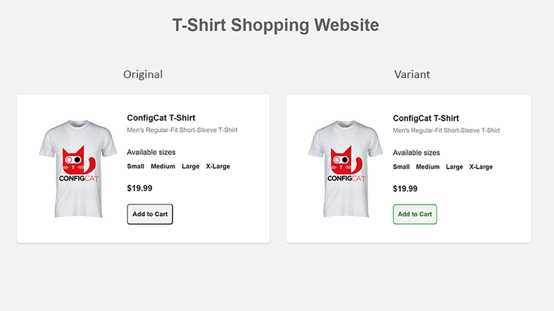

# ab-testing-dotnet-sample
A sample application showcasing how A/B testing with ConfigCat's Feature Flags and Amplitude can be done.

This app uses ConfigCat's feature flags and user segmentation system to change the color of the add-to-cart button. The feature flag toggle (ON/OFF) determines how the app behaves, and this change in color can influence the user clickthrough rate, which is measured by Amplitude.

https://configcat.com

## Build & Run

- clone the repository
- open the app in Visual Studio
- replace API key placeholders in code with actual API keys
- Run the app using the Visual Studio IDE

## Useful links to technical resources:
- Learn [C#](https://learn.microsoft.com/en-us/dotnet/csharp/)
- ConfigCat [Documentation](https://configcat.com/docs/)
- Amplitude [Documentation](https://www.docs.developers.amplitude.com/documentation-home/#install)

[**ConfigCat**](https://configcat.com) also supports many other frameworks and languages. Check out the full list of supported SDKs [here](https://configcat.com/docs/sdk-reference/overview/).

You can also explore other code samples for various languages, frameworks, and topics here in the [ConfigCat labs](https://github.com/configcat-labs) on GitHub.

Keep up with ConfigCat on [Twitter](https://twitter.com/configcat), [Facebook](https://www.facebook.com/configcat), [LinkedIn](https://www.linkedin.com/company/configcat/), and [GitHub](https://github.com/configcat).

## Author
[EMIL KOVAČEVIĆ](https://github.com/emilkovacevic)

## Contributions
Contributions are welcome!
