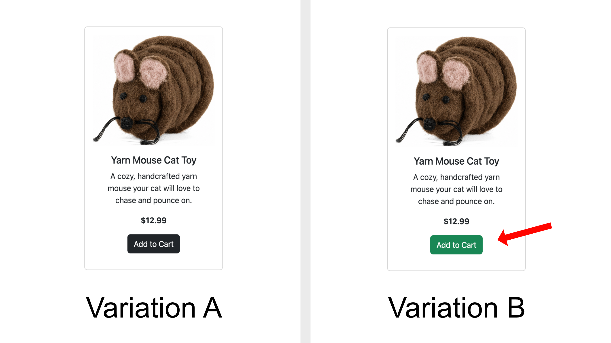

# A/B Testing in ASP.NET Sample App

A sample app showcasing how to conduct an A/B test experiment in ASP.NET using a [ConfigCat Feature Flag](https://configcat.com/featureflags/) and [Amplitude's analytics platform](https://amplitude.com/).



## Setup and Run

1. Clone this repository
2. Open the project in Visual Studio Code
3. Add your ConfigCat SDK key to `appsettings.json`
4. Launch the app in your browser with the following command:

```bash
dotnet run --launch-profile https
```

## Learn more:

- ASP.NET [Documentation](https://learn.microsoft.com/en-us/aspnet/core/)
- ConfigCat SDK for .NET [Reference](https://configcat.com/docs/sdk-reference/dotnet/generic-host/)
- Learn more about ConfigCat's feature flags [here](https://configcat.com/featureflags/)
- Amplitude [Documentation](https://www.docs.developers.amplitude.com/documentation-home/#install)


[**ConfigCat**](https://configcat.com) also supports many other frameworks and languages. Check out the full list of supported SDKs [here](https://configcat.com/docs/sdk-reference/overview/).

You can also explore other code samples for various languages, frameworks, and topics here in the [ConfigCat labs](https://github.com/configcat-labs) on GitHub.

Keep up with ConfigCat on [X](https://x.com/configcat), [Facebook](https://www.facebook.com/configcat), [LinkedIn](https://www.linkedin.com/company/configcat/), [GitHub](https://github.com/configcat), and the [News & Product Updates](https://configcat.com/docs/news/) page.

## Authors

- [EMIL KOVAČEVIĆ](https://github.com/emilkovacevic)
- [Chavez Harris](https://github.com/codedbychavez)

## Contributions

Contributions are welcome!
